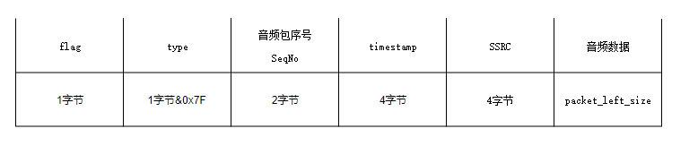
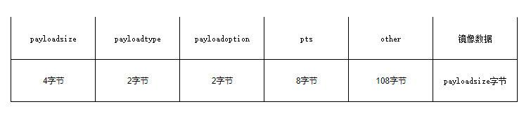

1、本工程是AirPlay 镜像服务器的go实现。 

2、因为AirPlay是个非常复杂且私有的协议、对于不同功能、服务发现时设置的flag、mode、features不同均会导致请求链接与参数不同。固本项目并不完善。此外本项目对非关键步骤未做处理，如启动NTP对时服务、启动event控制事件服务

3、本项目对最后的视频流和音频流均为做响应处理

4、关于音频包重传，在第3次setup中，传给客户端的controlPort用于监听音频包重传，如果音频包type为 0x56 则包将包含重新传输的音频包 、如果类型为 0x54，则包将包含有关 RTP 的信息

4、本项目使用了CGO，需要安装C/C++构建工具链，在macOS和Linux下是要安装GCC，在windows下是需要安装MinGW工具。同时需要保证环境变量CGO_ENABLED被设置为1，这表示CGO是被启用的状态。在本地构建时CGO_ENABLED默认是启用的，当交叉构建时CGO默认是禁止的。比如要交叉构建ARM环境运行的Go程序，需要手工设置好C/C++交叉构建的工具链，同时开启CGO_ENABLED环境变量。

5、本项目在macOS Intel X86-64 和windows10 AMD X86-64上测试，其他平台未做测试。（应该也跑的通）

> 音频包结构

> 视频包结构
> 
